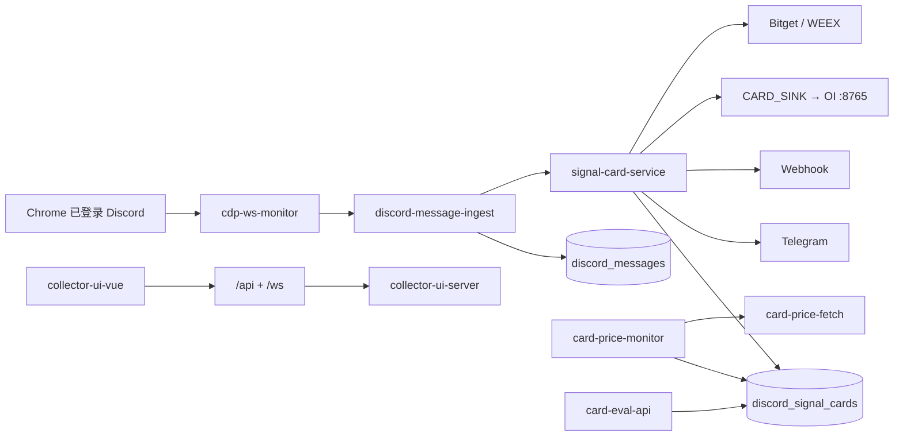

# discord-collector 开发说明

给后续改功能用的地图。部署/隧道细节仍看：

- [前端部署手册](./frontend-deploy.md)
- [前端上云 + 后台本地](./deploy-frontend-remote-backend-local.md)
- [WebSocket 推送架构](./websocket-push-architecture.md)
- [信号卡片模板](./card-templates.md)
- [OI Monitor](../oi_mornitor/README.md)

Cursor 规则在仓库根 `.cursor/rules/`（按打开的文件自动带上对应模块）。

---

## 1. 这是什么

用 **Playwright `connectOverCDP`** 附加已登录的 Chrome，监听 Discord 网页 Gateway/REST，把消息做成 **信号卡片**，再分发给 Telegram、交易所、评估页、OI。不走 Bot Token。

同仓还有：YouTube 文稿拉取、社区、内容板、Twitter 列表 CDP、Python OI 雷达。功能已稳定，**优先小改、复用现有模块，不要新开平行管线**。

---

## 2. 目录

```
discord-collector/
  src/                      Node 后台（ESM）
    collector-ui-server.js  ★ 主入口：HTTP + WS + 装配所有服务
    index.js                仅采集、无 UI 的备用入口
    config.js / load-env.js 配置（只读本目录 .env）
    store.js                MySQL + 离线 stub
    cdp-ws-monitor.js       Discord CDP
    discord-message-ingest.js
    discord-signal-*.js     频道解析 / 去重 / 卡片 / TG
    card-*.js               归档、现价、档位、评估、外送
    bitget-* / weex-*       自动/手动下单
    twitter-cdp-*.js        X 列表最新帖
    community-*.js          社区
    youtube-*.js            文稿代理 / 粘贴解析
  collector-ui-vue/         Vue3 面板（构建进 public/collector-ui/）
  oi_mornitor/              独立 Python OI（:8765）
  content_board/            独立 Python 内容板
  schema/init.sql           首次建库参考（运行时以 store.js 迁移为准）
  data/                     运行时 JSON（gitignore）
  docs/
```

工作区里其它目录（`stream-collector`、`telegram`、`youtube-fetch`…）是兄弟项目，默认不要改。

---

## 3. 本地怎么跑

```bash
cd discord-collector
cp .env.example .env          # MYSQL_*、CDP_CONNECT_URL、TELEGRAM_*
pnpm install
pnpm run collect:ui           # 后台 127.0.0.1:3851
pnpm run dev:ui-vue           # 前端 :5178，代理 /api /ws → 3851
```

Chrome（Discord）：

```text
chrome.exe --remote-debugging-port=9222 --user-data-dir="D:\chrome_debug_profile"
```

Twitter 建议 **另一个 profile + 9223**，避免和 Discord 抢同一个浏览器。

需要 OI 时再开 `pnpm run oi:start`（:8765）。`collect:ui` 里的 supervisor 可按 env 自动拉起。

| 端口 | 谁 |
|------|-----|
| 9222 | Chrome CDP（Discord） |
| 9223 | Chrome CDP（X，可选） |
| 3851 | collect:ui |
| 5178 | Vite Discord UI |
| 8765 | OI |
| 3920 | youtube-fetch（若单独起） |
| 11434 | Ollama（卡片 AI 风格，可选） |
| 8000 | 本机 Telegram send（`TELEGRAM_SEND_URL`） |

---

## 4. 主数据流



消息进卡片的条件：频道在 `discord-signal-config.js`（或 env 覆盖）里，且通过去重。

### 卡片产生之后

| 任务 | 模块 | 节奏 |
|------|------|------|
| 接近关键位推送 | `card-price-monitor` + `card-proximity-policy` | 约 5min |
| 档位入场/TP/SL | `card-level-progress` | `CARD_LEVEL_CHECK_MS` 默认 1h |
| 窗口到期结算 | `card-backtest-engine` `runAutoEval` | 到期才跑 |
| 评估看板 | `/eval` ← `GET /api/cards/eval/*` | 读 `progress_json` / 回测 |
| TP1 保本移损 | Bitget/WEEX `onTp1Breakeven` | ~30s |

评估口径（不要悄悄改）：未入场不计胜率；任意 TP=赢；先 SL=输；N 档 TP 各平 1/N。

---

## 5. 加功能清单

### 5.1 新 HTTP API

1. `src/foo-api.js` → `registerFooRoutes(app, service)`
2. `collector-ui-server.js` 在 `express.json` 之后调用
3. 前端 `collector-ui-vue/src/lib/fooApi.js` 用相对路径 `fetch('/api/foo')`
4. 实时事件：`broadcast("meta", { kind: "foo_bar", … })`

### 5.2 新 Vue 页面（四处）

1. `collector-ui-vue/src/lib/uiMode.js` → `ALL_UI_PAGES`
2. `vite.config.js` → `__UI_PAGE_FOO__`
3. `router/index.js` → global + 懒加载路由
4. `views/FooView.vue`

部署可见性：`.env.production` 的 `VITE_UI_PAGES`。**构建期注入**，改完必须 `pnpm run ui:build`。

### 5.3 新 Discord 信号频道

1. `discord-signal-config.js` 加 `channelId` + `parser` + 风格
2. `discord-signal-parsers.js` 实现该 `parser`
3. 需要分批开仓/补 TP：看 `discord-signal-staged-trade.js`（seven / 山寨之王已有模式）
4. 自动下单：`trade-platform-toggles.js` / `BITGET_AUTO_TRADE_CHANNEL_IDS`

### 5.4 新表或新列

只改 `store.js`：

- `CREATE TABLE IF NOT EXISTS`
- `ALTER TABLE … ADD COLUMN`（失败当已存在）
- 查询/写入方法
- **`createOfflineStore` 同名空实现**（否则 UI 在无 MySQL 时崩）

`schema/init.sql` 可补，但不能代替运行时迁移。

### 5.5 新环境变量

`src/config.js` + `.env.example`（必要时 README 表格）。布尔统一按 `0/false/off/no` 关闭。

---

## 6. 模块速查

| 需求 | 先打开 |
|------|--------|
| 装配 / 关停 | `src/collector-ui-server.js` |
| Gateway 解帧 | `cdp-ws-monitor.js` `discord-gateway-zlib.js` `collect-ws-decode.js` |
| 消息落库 | `discord-message-ingest.js` `discord-context-cache.js` |
| 卡片 | `discord-signal-card-service.js` |
| 现价 | `card-price-fetch.js` |
| 档位 | `card-level-progress.js` |
| 评估 | `card-eval-api.js` `CardEvalView.vue` |
| Show 布局 | `show-layout-store.js` `ShowView.vue` |
| 社区 | `community-api.js` `CommunityView.vue` |
| Twitter | `twitter-cdp-service.js` `TwitterCdpView.vue` |
| YouTube 队列 | `youtube-fetch-proxy.js`（上游默认 :3920） |
| 文稿粘贴 | `youtube-paste-parse.js` `youtube-paste-batch.js` |
| 内容板 | `content_board/` + `content-board-proxy.js` |

---

## 7. 约定与坑

- **代理**：Clash 会劫持 `127.0.0.1:9222` → CDP 400。`load-env.js` 已合并 `NO_PROXY`；新写的 CDP fetch 仍要直连。
- **`connectOverCDP` + `browser.close()`**：只断开 Playwright，不要关用户的 Chrome。
- **JSON 列**：MySQL JSON 用 `mysql-json.js` / `serializeRawJsonColumnForMysql`，不要对对象直接当字符串塞。
- **时间**：卡片评估锚点是 `signal_at`（缺省 `created_at`）。
- **前端 API**：一律相对路径，部署靠 Nginx 反代 `/api` `/ws`。
- **日志**：`DISCORD_CARDPULL_FORWARD_LOG`、`DISCORD_WEBHOOK_FORWARD_LOG` 等默认关，避免刷屏。
- **密钥**：`.env`、交易所 key、`CARDS_API_KEY` 不要提交。

---

## 8. 不要做的

- 不要为股票行情先接一套源（无配置则 `price_unavailable` / 跳过）。
- 不要把档位计价改去 oi_mornitor；OI 只收 `CARD_SINK`。
- 不要在 Discord CDP 页上顺便 scrape Twitter（端口/profile 分开）。
- 不要新增「第二套卡片表」。归档与信号共用 `discord_signal_cards`。
- 不要把 deploy 默认页塞满；本机工具页（`/twitter` `/debug` `/eval`）按需加进 `VITE_UI_PAGES`。
